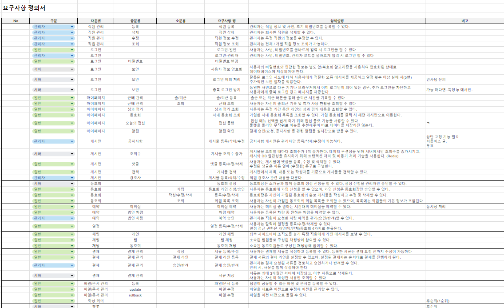
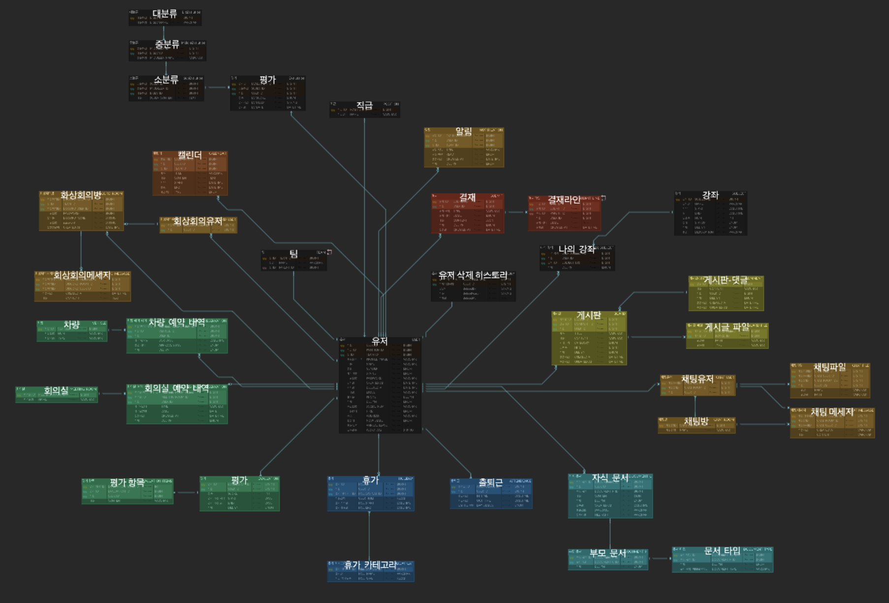

# EXODIA

## 📢 프로젝트 개요
사원들이 보다 효율적으로 업무를 수행할 수 있도록 회사 내 자체 웹 기반 HR 솔루션을 개발하는 것을 목표로 합니다.

근태 관리, 실시간 채팅, 문서 결제 및 버전 관리, 공간 및 차량 대여, 내부 게시판 서비스를 통합하여 다양한 업무를 한 플랫폼에서 관리할 수 있도록 합니다.

사용자는 별도의 외부 시스템을 이용하지 않고도 회사 내부의 모든 HR 관련 절차를 처리할 수 있습니다.

## 📝 요구 사항 명세서

[요구 사항 명세 보기](https://docs.google.com/spreadsheets/d/1VqdbBtMBag14rsCLODUl4LLlspbeZv8nNFEQy_W30PI/edit?gid=0#gid=0)

 

## 📝 WBS

[WBS 보기](https://docs.google.com/spreadsheets/d/1VqdbBtMBag14rsCLODUl4LLlspbeZv8nNFEQy_W30PI/edit?gid=1214013363#gid=1214013363)

 

## 🧱 ERD

[ERD 보기](https://www.erdcloud.com/d/cw7ygowDortnpZa2h)

 

## 🎨 화면 설계서

[화면 설계서 보기](https://www.figma.com/design/OACtwz498qgY2KQcehc7JD/POT?node-id=26-30&node-type=canvas&t=VYPzWBg5kbgZ2mF9-0)

 
